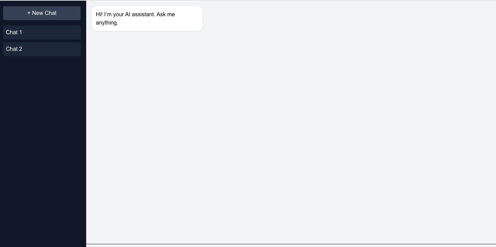
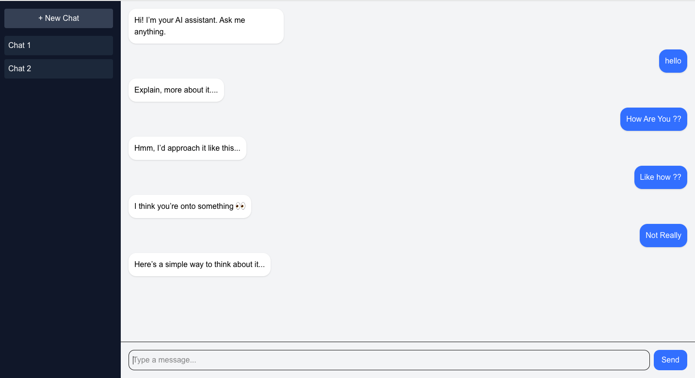

This is a [Next.js](https://nextjs.org) project bootstrapped with [`create-next-app`](https://nextjs.org/docs/app/api-reference/cli/create-next-app).

<p align="center">
  <a href="https://aichatuitype.vercel.app/">
    
  </a>
  &nbsp;
  <a href="https://github.com/srujanachalluri/aichatuitype">
    
  </a>
  &nbsp;
  <a href="https://github.com/srujanachalluri/aichatuitype/fork">
    
  </a>
</p>


<!-- Replace this with your actual screenshot after deployment -->


<br/>



<br/>

## Getting Started with Implementation

First, run the development server:

```bash
npm install
npm run dev
# or 
yarn dev
# or
pnpm dev
# or
bun dev
```

Open [http://localhost:3000](http://localhost:3000) with your browser to see the result.

You can start editing the page by modifying `app/page.tsx`. The page auto updates as you edit the file.

This project uses [`next/font`](https://nextjs.org/docs/app/building-your-application/optimizing/fonts) to automatically optimize and load [Geist](https://vercel.com/font), a new font family for Vercel.

## Learn More

To learn more about Next.js, take a look at the following resources:

- [Next.js Documentation](https://nextjs.org/docs) - learn about Next.js features and API.
- [Learn Next.js](https://nextjs.org/learn) - an interactive Next.js tutorial.

You can check out [the Next.js GitHub repository](https://github.com/vercel/next.js) - your feedback and contributions are welcome!

## Deploy on Vercel

The easiest way to deploy your Next.js app is to use the [Vercel Platform](https://vercel.com/new?utm_medium=default-template&filter=next.js&utm_source=create-next-app&utm_campaign=create-next-app-readme) from the creators of Next.js.

Check out our [Next.js deployment documentation](https://nextjs.org/docs/app/building-your-application/deploying) for more details.


## 👩‍💻 Author

<div align="center">

**Srujana Challuri** — Software Engineer

[](https://github.com/srujanachalluri)
[](https://master-portfolio-rho.vercel.app/)
[](https://linkedin.com/in/srujanachalluri)

</div>

---

## 📄 License

MIT License — free to use for learning or your own portfolio.

